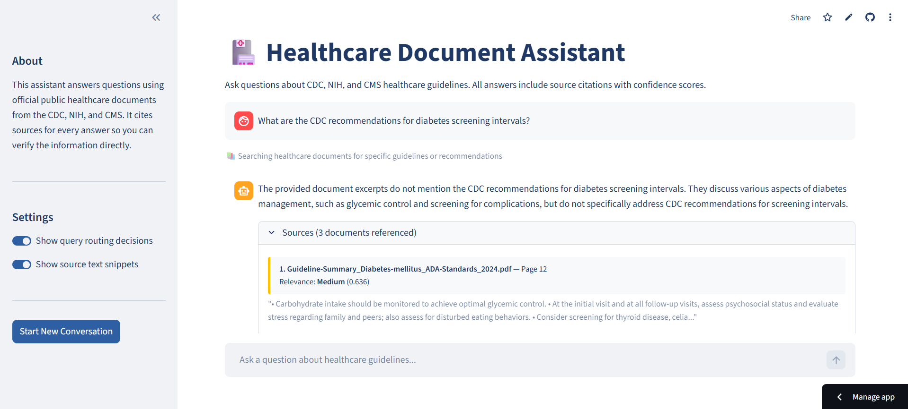

# Healthcare Clinical Guidelines Assistant

A RAG-powered chat application that answers questions about CDC, NIH, and CMS healthcare guidelines — with source citations, confidence scores, and conversation memory.

## Live Demo

**[Launch App](https://clinical-guidelines-assistant-emlr3kk5lgjqhw5fjqptgw.streamlit.app/)**

---

## Screenshot



---

## Background and Motivation

As an automation engineer, one pattern shows up across every industry I've worked in: valuable information is locked inside documents, and people spend significant time extracting it manually. Whether it's clinical protocols, compliance guidelines, or operational procedures, the bottleneck is rarely the information itself — it's the ability to access it quickly and reliably.

This project is a direct application of that problem. Public health guidelines from the CDC, NIH, and CMS are freely available but spread across dozens of PDFs. I built this tool to make those documents instantly queryable through natural language, with every answer traceable back to its source so users can verify what they're reading rather than trusting the model blindly.

---

## Key Features

### Conversation Memory
The assistant remembers what was said earlier in the session. If you ask "What are the CDC screening intervals for diabetes?" and then follow up with "What about for adults over 65?", it understands the context without you having to repeat yourself. This is implemented using LlamaIndex's `ChatMemoryBuffer` with a token limit to prevent the context window from growing unbounded.

### Source Citations with Confidence Scores
Every answer backed by a document search includes the source filename, page number, and a relevance score labeled High, Medium, or Low. This makes the tool auditable — users can open the original PDF and verify the guideline directly rather than trusting the model's output blindly.

### Intelligent Query Routing
Not every question requires a document search. A dedicated router classifies each query before it reaches the RAG engine, directing factual guideline questions to the vector store and general medical knowledge questions straight to the LLM. This prevents unnecessary retrieval calls and improves response quality for both query types.

---

## Sample Interaction

**User:** What are the CDC recommendations for adult diabetes screening?

**Routing decision:** 📚 Searching healthcare documents for specific guidelines or recommendations

**Assistant:** According to the CDC guidelines, adults aged 35–70 who are overweight or obese should be screened for prediabetes and type 2 diabetes. Screening should be repeated every 3 years if results are normal...

**Sources (3 documents referenced)**
- `dprp-standards.pdf` — Page 4 | Relevance: **High** (0.87)
- `Guideline-Summary_Diabetes-mellitus_ADA-Standards_2024.pdf` — Page 12 | Relevance: **High** (0.81)
- `obesity_guidelines_archive.pdf` — Page 2 | Relevance: **Medium** (0.63)

---

## Tech Stack

| Component | Technology | Purpose |
|---|---|---|
| LLM | Llama 3.3 70B via Groq API | Fast cloud inference — free tier available, no local GPU required |
| Embeddings | BAAI/bge-small-en-v1.5 via HuggingFace | Runs locally — no API key required, cached after first download |
| Vector Store | ChromaDB | Persists and retrieves document embeddings |
| RAG Framework | LlamaIndex | Orchestrates retrieval, memory, and response synthesis |
| UI | Streamlit | Chat interface with citation cards and session controls |
| Query Router | Custom LlamaIndex + Groq | Classifies queries before retrieval to improve response quality |

---

## Local Setup

### Prerequisites
- Python 3.10+
- A free [Groq API key](https://console.groq.com)

### 1. Clone the repo and install dependencies
```bash
git clone https://github.com/dsembiante/clinical-guidelines-assistant.git
cd clinical-guidelines-assistant
python -m venv venv
venv\Scripts\activate        # Windows
source venv/bin/activate     # Mac/Linux
pip install -r requirements.txt
```

### 2. Set your Groq API key
Create a `.env` file in the project root:
```
GROQ_API_KEY=your_key_here
```

### 3. Add your PDF documents
Place PDF files in the `docs/` folder. Public domain documents from CDC, NIH, and CMS are recommended. Aim for 8–10 documents covering related topics (e.g., diabetes, hypertension, heart disease) so the assistant can answer questions that span multiple sources.

### 4. Run ingestion
```bash
python ingest.py
```
> **Note:** The first run will download the `BAAI/bge-small-en-v1.5` embedding model from HuggingFace (~130MB). This only happens once — subsequent runs use the cached version and will be significantly faster.

### 5. Launch the app
```bash
streamlit run app.py
```

---

## What I Would Add Next

- **Authentication** — restrict access to verified clinical staff
- **Multi-collection support** — separate indexes for CDC, NIH, and CMS so users can filter by source agency
- **Feedback mechanism** — thumbs up/down on answers to track accuracy over time
- **Async ingestion** — background re-ingestion when new documents are added without restarting the app
- **Hybrid search** — combine vector similarity with keyword (BM25) search for better recall on acronym-heavy medical queries

---

## Author

Dominic Sembiante

LinkedIn: www.linkedin.com/in/dominic-sembiante-92b598149

GitHub: github.com/dsembiante

Built as part of an ongoing AI engineering portfolio exploring the evolution from traditional RPA and intelligent automation toward modern agentic AI architectures.
